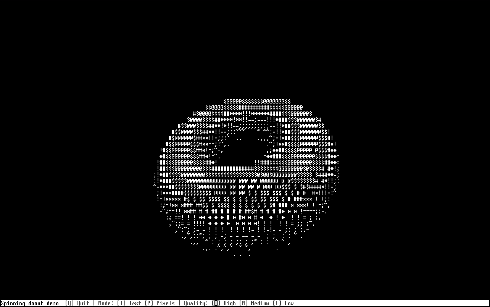
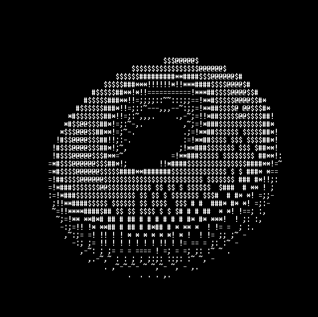
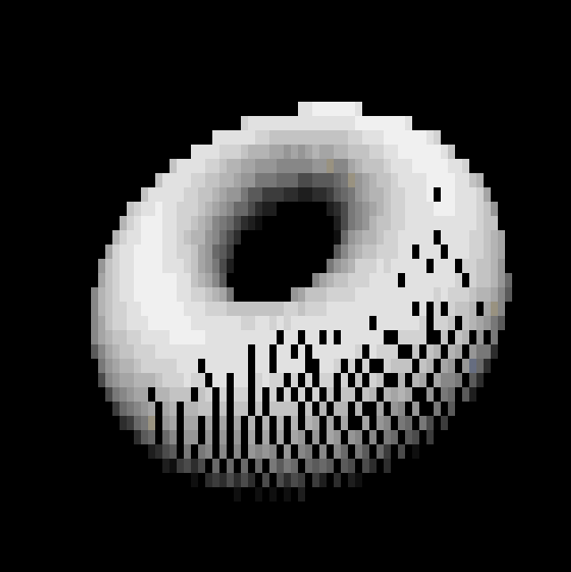

# Halyde Donut

This is a demo of a port of donut.c, ported over to Lua, meant to run on [Halyde](https://github.com/Team-Cerulean-Blue/Halyde), an operating system made to run on [OpenComputers](https://ocdoc.cil.li/).

This demo can be directly installed as an Argentum package by running `ag install donut`.

As of right now, this could also be installed by directly copying the file at `halyde/apps/donut.lua` to the same path in your OC machine's drive, but updates will not occur until you redo this process.

After installing this program, you can run it by running `donut`.

If you would like this to run on another OpenComputers operating system (like OpenOS), you can fork this repository and add your own changes that adds support to this operating system.

## Features
There currently are two modes. These modes indicate how the donut will get rendered to the screen:

| Text mode | Pixel mode |
|---|---|
|  |  |
| This mode renders brightness using traditional ASCII characters, coming directly from `donut.c`. | This mode renders brightness using an empty/space character with a specific background for every point. |

Rendering the donut can be very slow, so there are 3 types of quality: High, Medium, and Low.
The lower the quality is, the less resolution there is, the more artifacts show up, but more performance is gained.

At the very bottom of the screen, there are controls on how to change the mode, change the quality, and quitting out of the program.