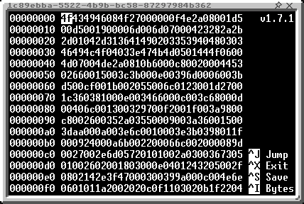

# Hextra
Hextra is an advanced hex editor for Halyde, with included binary decoding, direct text input, jumping, etc.

To install Hextra, run `ag install hextra`.

## Using Hextra
Hextra's design adapts to your screen resolution and GPU tier, so less detail is lost in the process. Here's how it looks across different GPU tiers:

| Tier 1 | Tier 2 | Tier 3 |
| --- | --- | --- |
|  |  |  |

The indexes start counting at 0, instead of starting at 1, to make it feel like a traditional hex editor.

The text section interpret a character's corresponding byte as an Unicode code point, which mirrors the [ISO/IEC 8859-1](https://en.wikipedia.org/wiki/ISO/IEC_8859-1) standard.
However, this does not mean Unicode characters inside a text file will show up inside this text section. If you wish to see Unicode characters, seek to the first byte and check the output of the "UTF-8 Character" or "UTF-8" entry in the decoding table.

In Tier 2, titles in decoding table entries are shorten down, and the "32-bit float" entry is removed due to it being very large.
There isn't unfortunately enough space to fit a decoding table on Tier 1.

Jumping works by pressing Ctrl+J: It will ask you for a position to jump to, with the default value being your current position in hexadecimal. This uses `tonumber()`, so entering a decimal value without the "0x" prefix will work fine.

Choosing between inputting raw hex values or direct keyboard text can be done by pressing Ctrl+I. "Bytes" means you are typing bytes in hexadecimal, and "Text" means you are typing text directly from the keyboard. Pressing Backspace in both modes will move your cursor to the left.

The decoding table defaults to using big endian. If the file format uses Low endian (e.g. CTIF), you can toggle between big endian and low endian by pressing Ctrl+E.

If you want to write a value from a type of the decoding table, you can press Ctrl+W, use the arrow keys to select the type to use, press Enter, then enter the value you want to insert. You can also click directly on of the entries of the decoding table to edit it.

You can save your edited file by pressing Ctrl+S. If you'd like to save it to another file, press Ctrl+Shift+S. Then, to exit, press Ctrl+X.