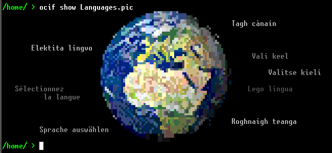
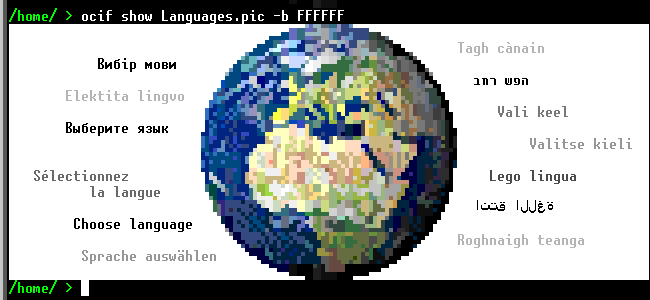

# OCIF Tools
This package contains an application named `ocif` that allows you to take a MineOS `.pic` file and show it on the screen, or convert it into ANSI art.
This package can be installed by running `ag install ocif-tools`.

This app is a frontend: If you're looking for a library, or some more in-depth documentation, check [libocif](../libocif/README.md).

This app was only tested on Tier 3 GPUs, as it is the required tier for MineOS to install.

## Show images
To show any picture on-screen, run `ocif show [file].pic`, while replacing "[file]" with the name of the file you want to show.

Images in MineOS are mostly transparent, like this one shown here for example. If you'd like to change the background color for transparent pixels, set the `-b` flag to the background color, in 24-bit hexadecimal.

## Convert to ANSI
To convert any picture into ANSI art, run `ocif to-ansi [file].pic [output]`. Replace "[file]" with the filename of the picture, and "[output]" with the filename of the output file.

### Problems with ANSI Compatibility
As of writing this, Halyde only supports ANSI with [4-bit color](https://cerulean-blue.gitbook.io/halyde-docs/libraries-and-apis/ansi-compatibility#colors). 24-bit are not yet supported, which are returned by libocif. The best way to view the ANSI content right now is to copy the output file into a Linux computer and view it on a terminal using `cat`.